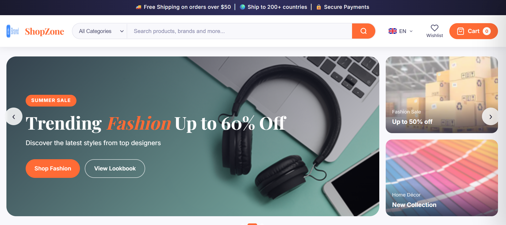
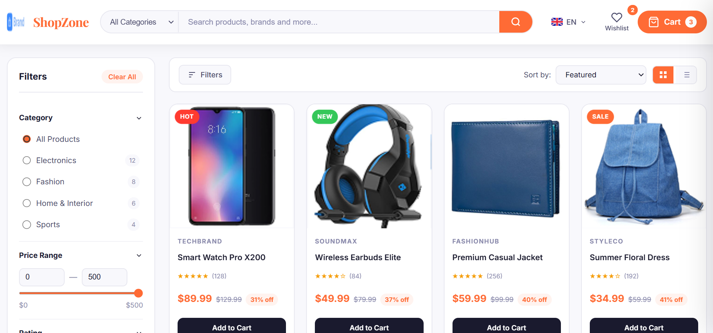
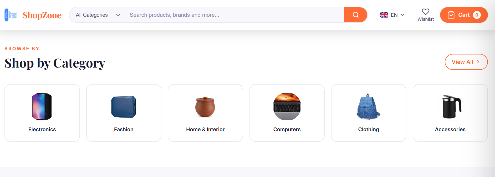
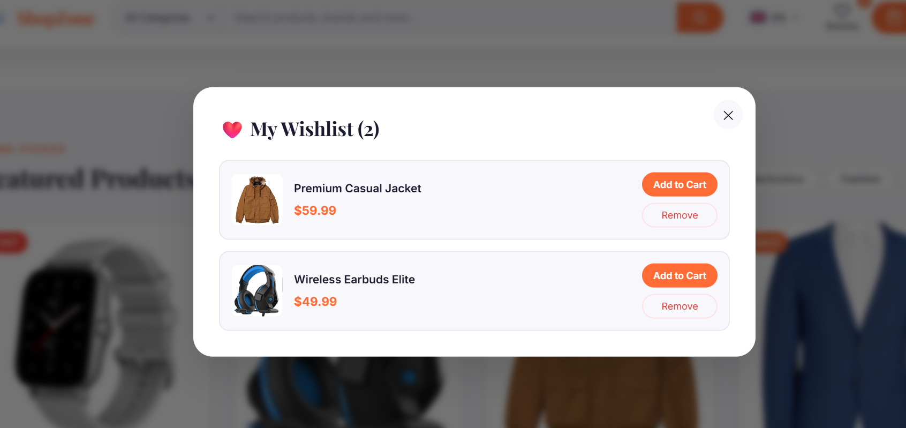
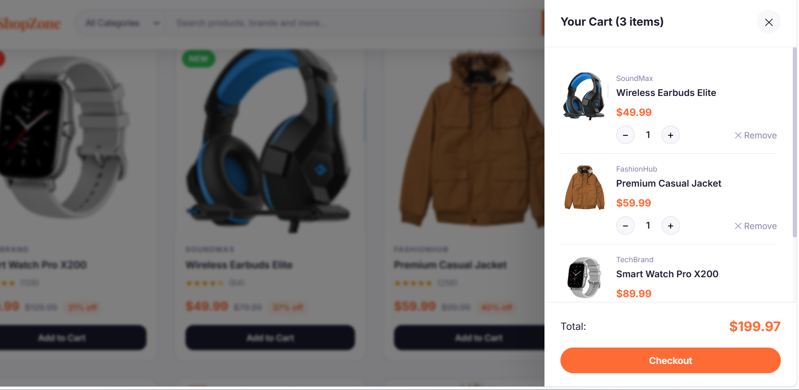
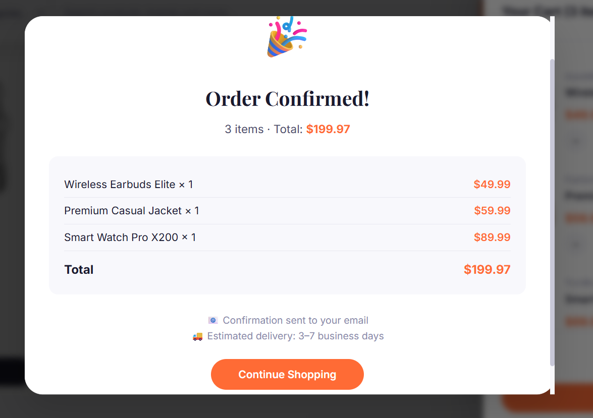

# 🛍️ ShopZone - Global Marketplace

A modern and responsive eCommerce website built using HTML, CSS, and JavaScript. The project provides an interactive online shopping experience with product browsing, filtering, wishlist management, shopping cart functionality, and responsive design.

---

## 📖 Project Overview

ShopZone is a front-end eCommerce web application developed using pure web technologies without any external frameworks. It offers a clean user interface, responsive layouts, and smooth user interactions across different devices.

---

## 📸 Screenshots

### Home Page



### Products Page



### Shop by category



### Wishlist



### Cart



### Checkout



---

## ✨ Features

### 🏠 Home Page

* Responsive Navigation Bar
* Hero Banner Section
* Featured Products Display
* Promotional Banners
* Newsletter Subscription
* Interactive Hover Effects

### 🛒 Products Page

* Product Listing Interface
* Product Search Functionality
* Product Filtering Options
* Product Sorting Features
* Responsive Product Grid
* Quick View Option

### ❤️ Wishlist

* Add and Remove Products
* Wishlist Counter
* Local Storage Support

### 🛍️ Shopping Cart

* Add Products to Cart
* Remove Products from Cart
* Update Product Quantity
* Persistent Cart Storage

### 📱 Responsive Design

* Mobile-Friendly Layout
* Tablet Support
* Desktop Optimization
* Smooth Animations and Transitions

---

## 🛠️ Technologies Used

* HTML5
* CSS3
* JavaScript (ES6)
* Local Storage API
* Google Fonts

---

## 📂 Project Structure

```text
ShopZone/
│
├── index.html
├── product.html
├── cart.html
├── practice.html
│
├── style.css
├── product.css
│
├── script.js
├── product.js
│
├── Product Images
├── Banner Images
├── Brand Logos
├── Country Flag Icons
│
└── README.md
```

---

## 🚀 Getting Started

### Clone Repository

```bash
git clone https://github.com/your-username/shopzone.git
```

### Run Project

1. Download or clone the repository.
2. Open the project folder in Visual Studio Code.
3. Install the Live Server extension.
4. Right-click on **index.html**.
5. Select **Open with Live Server**.

---

## 📱 Responsive Layout

| Device  | Support |
| ------- | ------- |
| Desktop | ✅       |
| Tablet  | ✅       |
| Mobile  | ✅       |

---

## 🔮 Future Enhancements

* User Authentication
* Product Reviews & Ratings
* Payment Gateway Integration
* Order Tracking System
* User Profile Management
* Backend Integration

---

## 👩‍💻 Author

**Neha Shehzadi**

---

## 📄 License

This project is created for educational and learning purposes.

---

⭐ If you like this project, consider giving it a star on GitHub.
